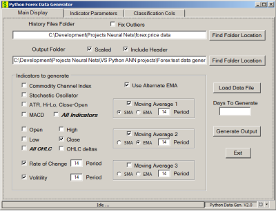

# Forex Indicator Data Generators

## **Introduction**

I built these applications so I could create csv files of Forex indicator data that I could input to my Python based Artificial Neural Networks. The main one, Forex Test Data Generator, was specifically written for that use.

The others I created much earlier for desktop apps I wrote to analyse Forex pair price patterns to improve my win/loss ratio in trading them.

## **About the projects**

These projects are written in C# and compiled with .Net 4.7.2, x86 target on a 64 bit Windows 7 Pro platform using Visual Studio 2017. Everything in them is standard Windows Forms based technology. There are no third party tools or objects.

The input data files are expected to be Meta Trader 4 history files. However, you can use anything that follows the MT4 layout: date, time, open, high, low, close, volume. You can get this data elsewhere online or from other Forex platforms. The expected file format is standard comma delimited csv files.

## **Using them**
***
**Forex Data Generator**

This is the one I wrote specifically for input to my Python ANN work. The choices were mostly dictated by a couple Ph.D. papers that indicated some success with a few of these and then I added some very common types to test for usefulness depending on whether or not one is trying a classification or a regression analysis.

As you can see the interface is very flexible as to what comes out. You can do a simple Close price output, or the full list. I have tried to include all the common indicators you find in MT4 and MT5 but there isn't room for everything. I am including some other apps that can add some additional indicators if you like.

## License

Forex Indicator Data Generators project is licensed under GNU GENERAL PUBLIC LICENSE Version 3.

## Contribution

To report an issue use the GitHub issue tracker. Please provide as much information as you can.
Contributions are always welcome. Open an issue to contact me. The preferred method of contribution is through a github pull request. 

## **What's next**

After I get this project settled down into GitHub I'm going to write a supervisory application for my Z-Wave automation modules and mount it as a Windows Service. That should keep me busy for a while. Once the dust settles on that I'm headed back into machine learning. I spent a year researching all the Ph.D papers I could find and then learned Python and a dozen API's like scikit_learn. I've gotten some decent results programmatically but I was getting burn-out so I moved to these projects to clear my head. I am now ready to get into some fuzzy math architecture which apparently has been improving results on time series data -- the holy grail of statistics and machine learning. The other interesting architecture is reservoir ensembles mated up with both regression and classification ANN's.
